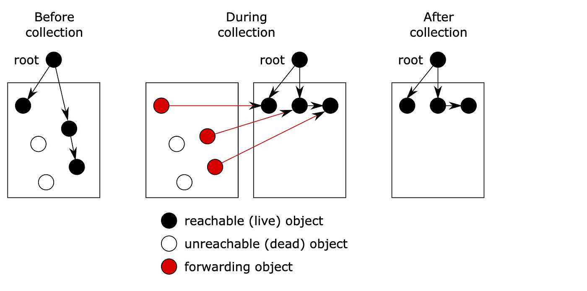
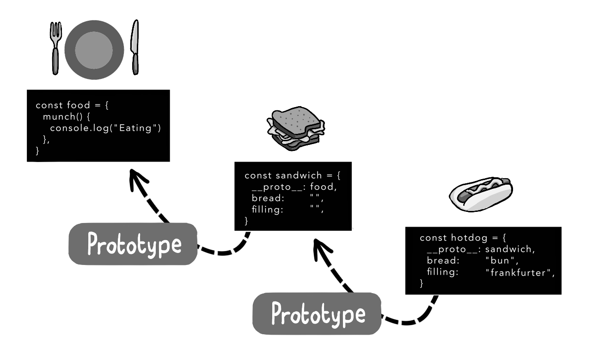
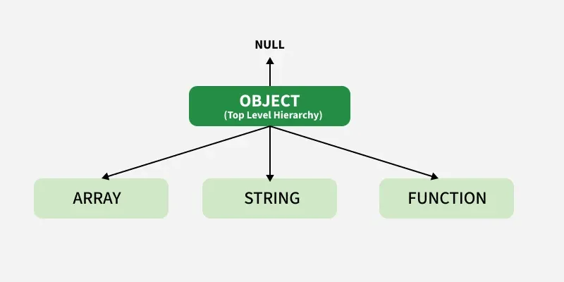

Java-Script_Mastry
Oraily book Advanced Topics , based on Micro.ai interview (now You Know what is the level you want to be in the lang to be Mastry Javascript engineer )

|||||||||||||||||||||||||||||||||||||||||||||||||||||||||||||||||||||||||||||||||||||||||||||||||||||||||||
  
  
  # 1 - Garbage Collector 

  

   # 2 - JavaScript is ProtoType based  
  
  
